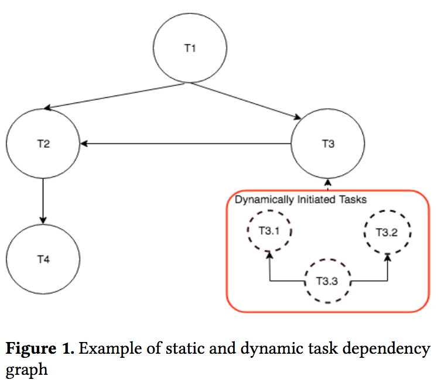

>  This work was done as the final project for Parallel and Distributed Computing (CMPT 886) Fall 2019.

Contributors:  Parham Yassini (pyassini@sfu.ca) , Pouria Vaziri (pouria.vzr@gmail.com)

<!-- TABLE OF CONTENTS -->
<details open="open">
  <summary>Contents</summary>
  <ol>
    <li>
      <a href="#about-the-project">About The Project</a>
    </li>
    <li>
      <a href="#getting-started">Programming Interface</a>
    </li>
    <li>
      <a href="#getting-started">Features and Design Choices</a>
    </li>
    <li><a href="#acknowledgements">Acknowledgements</a></li>
  </ol>
</details>

# About the Project
The goal of this project is to implement an efficient concurrent task scheduler and executor that runs user defined tasks in parallel based on their dependencies and priorities. We present a simple programming interface for using the scheduler which lets users to define task dependency graph along with task priorities and pass the tasks to our executor. 

The execution of tasks is done asynchronously using a *thread pool* and after calling the executor, the main thread program will continue to execute. Task results will be available in a *future* buffer and user can read the task results from the filled buffer after termination of the execution. 

The scheduler also supports priority-based scheduling and dynamic task allocation were a child task can dynamically submit new tasks (with their dependencies) during its execution time.

As example applications, we have implemented graph triangle-counting and a synthetic benchmark application with binary tree shape task dependencies on top of our scheduler.

**Compile and Run**:
> Use --nthreads to specify number of concurrent threads in threadpool for running the taks.
```shell
g++ -std=c++11 -lboost_program_options main.cpp -o test
./test --help
./test --nthreads 4
```
# Programming Interface
Tasks are instances of functions that should be executed and the dependencies between these tasks is in form of a Directed acyclic graph (DAG).

> Note: Throughout this project and in the source codes, we use the term "parent of the task" for a task that depends on that task. For example, in the shown task dependency graph, T3 and T2 are parents of the T1 task since they should be executed after T1.



## Task Deceleration
In the *Task* class, user can define the function interface and the parameters each task should hold. In the main thread, user just needs to make new instances of the *Task* class and make a vector of Tasks.

In the constructor of *Task*, user can pass the **priority**, **id** and the **function()** to be executed along with the parameters to be passed to that function.

Before executing tasks, user should call the function **make_topology()** and then the execution of the tasks will begin by calling the **execute()** function.


## Task Dependency and Priority
In the implemented program, we represent dependency graphs by an unordered map between a *Task* and *vector of Tasks* which holds  dependencies. 

By calling the function **precede()** user can define the dependency between a pair of tasks. 

The task priority values are unbounded so that user can assign each task a different priority level when desired. 

> **Important Note:** that priority values are only used for giving precedence to tasks when all of them can be executed in parallel. Priority of tasks that depend on each other won't effect their order of execution.

Example:
```
vector<Task *> tasks;
unordered_map<Task *, vector<Task *>> DAG;
for (int i = 1; i <= num_tasks; i++) {
        tasks.push_back(new Task(i));
    }
tasks[1]->priority = 0; // Setting priorities
precede(DAG, tasks[2], tasks[1]); // tasks[2] results should be available before executing tasks[1]
```

### Dynamic task dependencies
For dynamic task dependencies, each task function can initiate child tasks and define dependencies between the child tasks by making a new sub graph. The procedure for making the sub graph is similar to what we described for making the main graph. After making the dependencies the sub-graph can be attached to the main graph by calling the **update_topology()** function.


## Task Results
Execution of the tasks are done by a thread pool in an asynchronous manner and user code in main function will progress when tasks are executing. To check for the completion of the execution, user can check the nish ag of the scheduler. After completion, the result of tasks will be readable by calling **get()** on the map of results.


# Features and Design Choices

## Scheduler
Scheduling starts with calling the *make_topology()* function. We map each *Task function* to a class called *TaskNode* which contains information about number of dependencies and level of a task in the graph. 
### Topological Sort
First the scheduler uses topological sort to resolve a dependency graph and find a valid ordering of tasks. The implemented Kahn’s algorithm for topological sort is based on the description from [this lecture](https://web.stanford.edu/class/archive/cs/cs106x/cs106x.1192/lectures/Lecture25/Lecture25.pdf).  In iterations of the topological sort, we assign each node with it’s parents (dependents). Parents are stored in a map between a node and set of nodes. Also, during topological sort, the last level of the graph (Sources of the dependency graph) or leafs of the execution tree are enqueued to the main queue of the scheduler.

In the impelemented scheduler, tasks that their constraints are satisfied will be enqueued on the main execution queue. The executor would dequeue the tasks and dispatch them to the thread pool as explained later. After execution of a task function, the parent of that task will be added to the queue for execution.

### Skiplist-Based Concurrent Priority Queue
 We use a priority queue as the main queue for scheduling tasks with their dependencies. This component is a critical performance bottleneck as multiple threads need access to the queue concurrently. 
To schedule tasks with different priorities effciently, we implemented a concurrent priority queue instead of using multi-level queues with different priorities.
The algorithm is based on Shavit and Lotan's [paper].(http://people.csail.mit.edu/shanir/publications/Priority_Queues.pdf)


## Executor
Tasks that their dependency constarints are met, are submitted to the main queue of the scheduler. 
In the thread pool, threads repeatedly wait on a *std::condition_variable* which indicates that there is a job to be done. Scheduler function *submit_task()* sends a function to the thread pool to be executed. 

> We made a wrapper function over user defined functions, so that scheduler always submits the same function to the pool but inside the wrapper we pass the actual function assigned to each task. 

After executing user thread function, *continue_topology()* is called which checks the parents of the last executed tasks and if parents’ dependencies are satisfied, they will be pushed to the main queue and submits the remaining tasks in the main queue to the thread pool.

### Communication Between Scheduler and Threads
A lock-free queue is implemented to allow communication between scheduler and threads concurrently and with minimum overhead. 

In *submit_task()*, function is passed as parameter; inputs of the passed function are binded to a function and it is wrapped in a void function pointer using *std::make_shared* *std::packaged_task*. This function is enqueued to the thread pool queue and one thread (which was waiting on the condition variable) is notified to wake and execute the enqueued job. In this way, we handle concurrent job submissions by different nodes during execution. Whenever a job becomes available, a thread will wake and execute the job.

## Termination Detection
To determine when the execution of all tasks is finished, we used an atomic counter which is increased whenever a leaf node (node with highest level of dependencies) is added to the dependency graph. 

The number of leaf nodes when performing topological sort is saved in the atomic counter, and later after execution of each task, the scheduler checks if the node was leaf and it decrements the counter using *fetch* and *sub* operations.
If the counter reaches 0, it informs the main thread using a boolean flag. 

With this design choice, we reduce contention for accessing the atomic counter, since only the leaf nodes would change the value of the counter.
